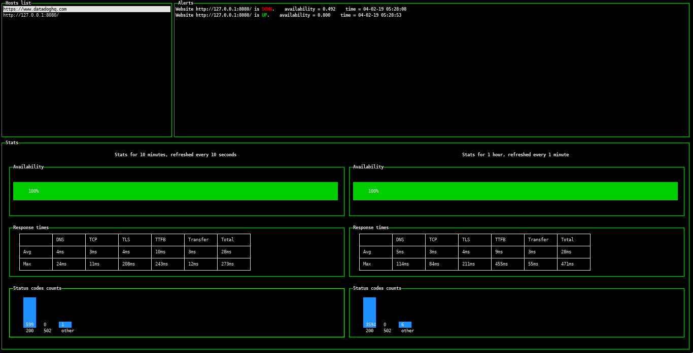

# Uptime-monitor

## Introduction

Uptime-monitor is my take-home assignment for the Datadog hiring process.



## Architecture
### Introduction
The monitor has four different functions to fulfill:
* Fetching the metrics for the desired hosts
* Processing the fetched data to raise availability alerts if needed
* Storing the metrics and the alerts for future use and history purposes
* Displaying statistics and alerts in a usable way for the user

According to those considerations, the uptime-monitor is separated into four distincts parts:
* <code>fetch</code>: CLI program used to fetch data from websites
* <code>process</code>: CLI program for alert processing
* <code>database</code>: TimescaleDB database for storing metrics and alerts
* <code>dashboard</code>: Dashboard for statistics and alert display

## Design choices
The choice of separating the different parts of the program has been made for two reasons:
* A good separation of functions makes the code easier to understand, and to maintain.
* A dashboard does not answer to the same use case as the fetch or the process operations, and thus each part should strictly do what it is needed for. This could even allow the different parts of the monitor to run on different machines (with the appropriate config).

Willing to keep the workflow as simple as possible, each part (*fetch*, *process* and *dashboard*) only connects to the *database*.\
To store the metrics and alerts, we chose TimescaledDB, as it is a database developped exactly for this kind of use cases.

## Directory architecture
Each part has a corresponding sub-directory in the <code>lib/</code> directory.\
The <code>util</code> sub-directory contains files that are used by different parts of the program.\
A <code>log</code> sub-directory is needed to store the different log files.

The project has the following directory architecture:
```
.
`-- lib
    |-- cli
    |-- config
    |-- dashboard
    |-- database
    |-- fetch
    |-- log
    |-- process
    `-- util
```

# Requirements
To run this project, recent version of:
* **NodeJS**
* **npm** or **yarn**
* **Docker** and **docker-compose**
* **TimescaleDB** (runs in a container, see the *installation* section for more informations)\

are required.

Each parts has been thoroughly tested on **Linux only**, but should also work on **MacOS**.\
I am not sure that it could run on **Windows**.

# Installation
* Clone the github repository
* Install all dependencies using <code>yarn install</code> or <code>npm install</code>
* Create the timescaleDB container: 
    * <code>docker-compose up -d</code> (the container will somehow exit after the creation of the database, and I didn't have time to figure out why)
    * This will create the container, initialize the database and create the tables, using the file <code>initDatabase.sql</code> in <code>lib/database/</code>

# Configuration file
The config file can be used to modify the monitored websites, as well as any time interval (the timespan for the alerts or the statistics, the fetching frequency,...).\
The current setup is the following:
* Data is fetched from every website every second
* Alerts are processed every 5 seconds
* The dashboard checks every second for new alerts, every 10 seconds for the 10 minutes statistics, and every minute for the hour statistics

The password for the database has been put in the general config file for testing, because a password was mandatory for the postgres connection with NodeJS and the database is only exposed to the localhost in the current config, but this should not stay in a production environment. It should be imported from an untracked secrets.js config file, and the password should not be *password*. 

# Usage
First, the timescaledb container needs to be started : <code>docker-compose start</code>

To start the differents parts of the project, two solutions are available:
* Using the cli options (starting from the root of the repository):
    * <code>node ./lib/cli/uptime-monitor.js [command]</code>, replacing *command* with either *fetch*, *process* or *dashboard*.
    * This will start the corresponding program in the command line in the foreground. For *fetch* and *process*, it is possible to execute the command in the background by appending *&* at the end of the line.
* Deamonize the processes by using pm2:
    * If not already installed, execute <code>sudo yarn add pm2 -g</code> or <code>sudo npm install pm2 -g</code>.
    * Then, <code>pm2 start uptime-monitor.yml</code> to start the *fetch* and the *process* parts. The dashboard cannot be deamonized for design reasons.
    * To restart the processes at startup, execute <code>pm2 startup</code>.

Alert processing is delayed by 2 minutes at the start of the process program, to prevent false alerts on monitor startup

## Dashboard
If the *fetch* and *process* parts are already started, you can start the dashboard as explained above.
To change the host, click on the *Host lists* box to focus it, then use the *up* and *down* arrow keys to navigate through the hosts.\
To scroll through the alerts, use the same method on the *Alerts* part of the dashboard. 

# Code style rules
To guarantee a clean coding convention throughout the files, we used *eslint* with the airbnb coding convention to lint our code.

# Testing the alerting logic
To test the alert logic, the file <code>test-server.js</code> implements a custom http server. You can start it with 
```node test-server.js```\
Its url is already monitored by default, so you can start the dashboard then bring the server up and down to test the alerting logic.

# Improvements
## Metrics analysis and storage
* **Response time display**: an average response time graph could be added to detect temporary increase.
* **Data stacking**: if the fetch or the process programs cannot connect to the database or fail to store data in it, the metrics will be lost. This is a problem, for example if each parts of the monitor were to be deployed on separated machines: the fetch program could lost its internet connection, losing a lot of data. To prevent that, we should implement a stack on the fetch and the process programs. Data would be pushed to the stack, and the program would periodically try to empty the stack by inserting the data into the database.
* **Error handling**: There is no difference made between missing data and actual errors from the websites. This should be taken care of, to prevent triggering false alerts.
* **Redirections**: Redirections are currently not followed. It could be interesting to implement this functionality as it can be relevent to measure the experienced response time on the user end.
* If we decided to execute the differents parts of the monitor on separated machines, we could choose to run the fetch program on the machines hosting the monitored websites, allowing it to gather more data, such as the number of connections per second, and potentially process more informations in the *process* part of the monitor.
## Dashboard
* Due to the use of tables for the response time display, the dashboard is not responsive. Small screen will not display the response times correctly. Making the dashboard responsive would improve the UX.
* When the dashboard is resized, it is not properly refreshed. We should increase the refresh frequency or find a way to refresh the screen on dashboard resize.
* Text is quite small. Bigger letter would prevent eye tiredness and improve the UI.
## Testing
* **Unit testing**: if the project develpment would continue, manually testing the alerting logic would not be enough. We should write unit tests to improve the project's reliability and maintainability.

